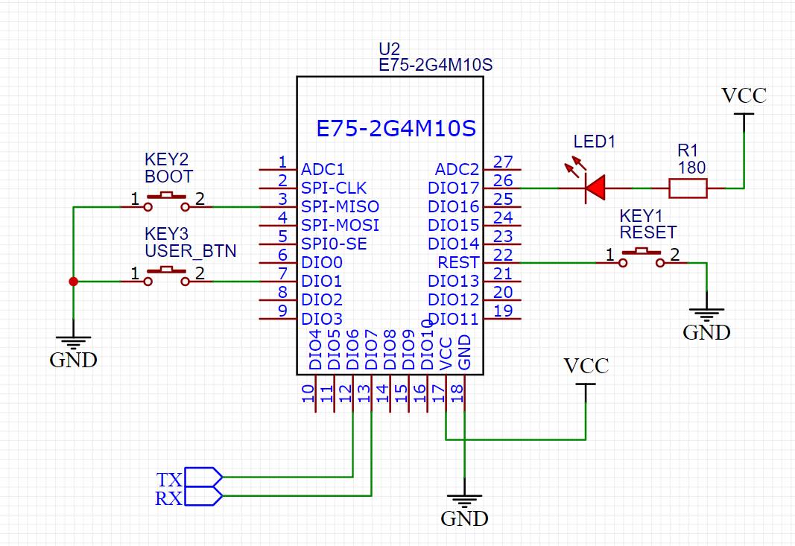

# Hello NXP JN5169 World

This is a tiny example how to work with JN5169 microcontroller, with just a few basic excercises to drive button, LED, timers, and queue.
The code is inspired but not based on official examples. Instead it provides a really lightweight way of compiling the code.

This does not yet cover ZigBee part of the microcontroller.

# Test board

Basically the code is almost independent of the hardware. I am using a simple schematics based on a cheap EBYTE E75-2G4M10S module.

# How to build

Prerequisites:
- Beyond Studio IDE (comes with a JN5169 compiler)
- ZigBee SDK (JN-SW-4170 Zigbee 3.0 v1840.zip)
- CMake (any recent one)
- MinGW (or other source where you can get `make`)
- This all is Windows only

Build instructions
- Clone the repo
- make a `build` directory
- `cd build`
- `cmake -G "MinGW Makefiles" -DTOOLCHAIN_PREFIX=C:/NXP/bstudio_nxp/sdk/Tools/ba-elf-ba2-r36379 -DSDK_PREFIX=C:/NXP/bstudio_nxp/sdk/JN-SW-4170 ..`
(Correct paths to the toolchain and sdk if needed)
- mingw32-make HelloWorld.bin

Flash instructions
- Open Beyond Studio
- Put the device in the programming mode (drive SPI_MISO low while reset or power up)
- Go to Device->Program Device
- Select the built HelloWorld.bin file
- Click `Program` button
